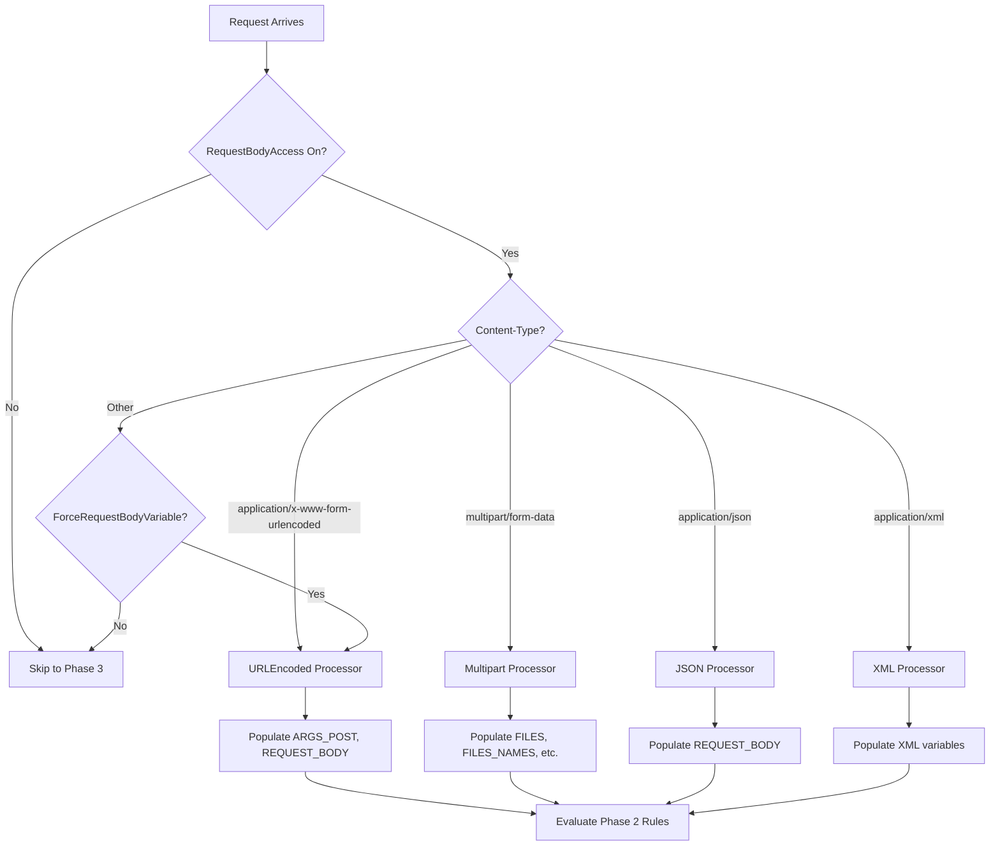

## BodyBuffer

BodyBuffer is used to effectively handle large bodies. Coraza has to buffer the body in order to make reliable blocking possible. Future versions might implement a more efficient solution.

`BodyBuffer.Reader` is a `io.Reader` that reads from either a memory buffer or a file. Using files is disabled for tinygo.

**Important:** Copying a Reader to BodyBuffer will most likely flush the original reader. In most cases you will have to keep two copies of the reader, one for coraza, and one for your application. You can simply replace your reader pointer with the BodyBuffer reader pointer.

## Body Processors

Body processors are designed to handle requests and responses in the same context. Most processors can handle either a request or a response, but there are cases of body processors like JSON, that can handle request and response in different context. Request-Response correlation is the responsibility of the processor, and the current use-case is GraphQL.

| Body Processor            | Request | Response | Correlation | Tinygo support |
|---------------------------|---------|----------|-------------|----------------|
| URLEncoded                | Yes     | No       | No          | Yes            |
| XML (Partial Support)     | Yes     | Yes      | No          | No             |
| Multipart                 | Yes     | No       | No          | Yes            |
| JSON                      | Yes     | Yes      | No          | Yes            |
| GraphQL                   | TBD     | TBD      | Yes         | TBD            |

