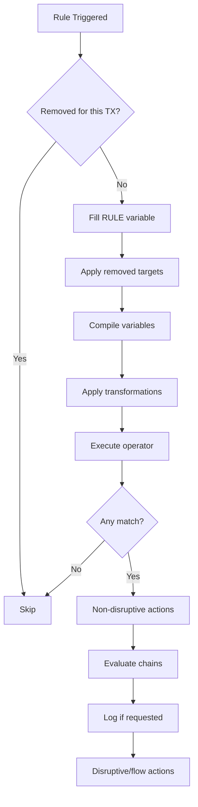

## Motor WAF

Waf es la interfaz principal utilizada para almacenar configuraciones, reglas y crear transacciones. La mayoría de las directivas establecen variables para las instancias Waf. Una implementación de Coraza puede tener instancias Waf ilimitadas y cada Waf puede procesar transacciones ilimitadas.

## Transacciones

Las transacciones son una instancia de una llamada URL para una instancia Waf. Las transacciones se crean con ``wafinstance.NewTransaction()``. Las transacciones contienen colecciones y configuraciones que pueden ser actualizadas mediante reglas.

## Expansión de macros

Las expansiones de macros son una función disponible para las ``transactions``. Una expansión de macro compilará una cadena y proporcionará datos de variables al contexto actual. La expansión de macros se realiza ejecutando una expresión regular que encontrará ``%{request_headers.test}`` y reemplazará el valor usando:

```go
v1 := tx.GetCollection(variables.RequestHeaders).GetFirstString("test")
v2 := tx.MacroExpansion("%{request_headers.test}")
v1 == v2
// true
```

## Reglas

Las reglas son activadas por ``RuleGroup.Evaluate(phase)`` basándose en el número de fase. Las reglas con fase 0 o ``rule.AlwaysMatch`` siempre se ejecutarán. Las reglas que siempre se ejecutan son SecMarkers o SecActions, lo que significa reglas sin operadores.

Las reglas marcadas con un SecMarker se utilizan para controlar el flujo de ejecución e indicar a la transacción que deje de omitir reglas desde ``skipAfter``.

A diferencia de ModSecurity, cada regla es un struct único en Coraza y se comparte entre cada transacción de la misma instancia ``Waf``, lo que significa que una transacción nunca debe actualizar ningún campo de una Regla y todos los campos **variables** deben almacenarse dentro de la transacción.

Una vez que se activa una regla, seguirá el siguiente flujo:



1. Omitir si esta regla fue eliminada para la transacción actual
2. Llenar los datos de la variable ``RULE`` que contiene campos de la regla actual
3. Aplicar los objetivos eliminados para esta transacción
4. Compilar cada ``variable``: normales, contadores, negaciones y "coincidencia siempre"
5. Aplicar transformaciones para cada variable, coincidencia simple o múltiple
6. Ejecutar el operador actual para cada variable
7. Continuar si hubo alguna coincidencia
8. Evaluar todas las acciones no disruptivas
9. Evaluar cadenas recursivamente
10. Registrar datos si fue solicitado
11. Evaluar reglas ``disruptivas`` y de ``flujo``

El retorno de esta función contiene cada ``MatchData``, que indicará a la transacción exactamente dónde se encontró la coincidencia, **Variable, Clave y Valor**. Quizás deberíamos agregar si fue una negación en el futuro. SecActions y SecMarkers retornarán un marcador de posición.

**Importante:** Las reglas pueden actualizar el comportamiento de una ``Transaction`` pero no de una instancia ``Waf``.

### Operadores

Los operadores se almacenan en ``github.com/corazawaf/coraza/tree/v3/dev/internal/operators`` y contienen una función de inicialización y una función de evaluación. Los inicializadores se usan para aplicar argumentos durante la compilación, por ejemplo, ``"@rx /\d+/"`` ejecutará ``op.Init("/\\d+")``. ``op.Evaluate(tx, "args")`` se aplica para cada variable compilada y retornará si la condición coincide. Los operadores usan ``Transaction`` para crear registros, capturar campos y acceder a variables adicionales de la transacción.

**Nota:** Los operadores deben ser seguros para uso concurrente.

### Acciones

Las acciones se almacenan en ``github.com/corazawaf/coraza/v3/internal/actions`` y contienen una función de inicialización y una función de evaluación. Los inicializadores se evalúan durante la compilación, por ejemplo, ``id:4`` ejecutará ``act.Init("4")``. Dependiendo del ``Type()`` de cada acción, se ejecutará en diferentes fases.

* **No disruptivas:** Realizan algo, pero ese algo no afecta ni puede afectar el flujo de procesamiento de reglas. Establecer una variable o cambiar su valor es un ejemplo de una acción no disruptiva. Las acciones no disruptivas pueden aparecer en cualquier regla, incluyendo cada regla perteneciente a una cadena. **Las reglas no disruptivas se evalúan después de que la regla coincida con algún dato**.
* **Acciones de flujo:** Estas acciones afectan el flujo de reglas (por ejemplo skip o skipAfter). Las acciones de flujo se evalúan después de que la regla coincida exitosamente y solo se ejecutarán para la regla padre de una cadena.
* **Acciones de metadatos:** Las acciones de metadatos se usan para proporcionar más información sobre las reglas. Ejemplos incluyen id, rev, severity y msg. Las reglas de metadatos solo se inicializan, no serán evaluadas, ``act.Evaluate(...)`` nunca será llamado.

### Transformaciones

Las transformaciones son funciones simples para transformar una cadena en otra cadena. Existe un struct especial llamado ``transactions.Tools``, que contiene "herramientas" útiles requeridas para algunas transformaciones, las cuales son ``UnicodeMapping`` para ``utf8ToUnicode`` y ``waf.Logger`` para depurar transformaciones. Más campos podrían agregarse en el futuro.

**Nota:** Las transformaciones se evalúan miles de veces por transacción y deben ser SÚPER RÁPIDAS.

## Grupos de reglas

Los grupos de reglas son como las ``Rules`` de ModSecurity, es simplemente un contenedor para reglas que retornará la lista de reglas de forma segura para concurrencia y evaluará las reglas basándose en la fase solicitada.

## Colecciones

Las colecciones son usadas por Coraza para almacenar ``Variables``. Todas las variables se tratan como el mismo tipo, ya sean mapas de valores, valores individuales o arreglos.

Las colecciones se almacenan como un slice ``[]*Collection``, cada índice se asigna basándose en su nombre constante proporcionado por ``variables.go``. Por ejemplo, si quieres obtener una colección puedes usar ``tx.GetCollection(variables.Files)``. Si quieres transformar una variable con nombre a su constante puedes usar:

```go
b, _ := variables.ParseVariable("FILES")
tx.GetCollection(b)
```

En el siguiente ejemplo mostramos la salida de ``tx.GetCollection(variables.RequestHeaders).Data()``.

```json
{
    "user-agent": [
        "some user agent string"
    ]
}
```

Algunos métodos auxiliares pueden usarse para estos casos, como ``tx.GetCollection(variables.RequestHeaders).GetFirstString("")``.

Las variables se compilan en tiempo de ejecución para soportar Regex (precompiladas) y XML, mediante la función ``tx.GetField(variable)``. Usar RuleVariable.Exceptions y []exceptions puede parecer redundante pero ambos son diferentes, la lista de excepciones se complementa desde la regla. En caso de Regex, ``GetField`` usará ``RuleVariable.Regex`` para hacer coincidir datos en lugar de ``RuleVariable.Key``.

**Nota:** Las colecciones no son seguras para concurrencia, no compartas transacciones entre goroutines.

## Fases

Las fases son usadas por ``RuleGroup`` para filtrar entre fases de ejecución en HTTP/1.1 y HTTP/1.0.

**Fase 1: Encabezados de solicitud**

Esta fase de procesamiento consiste teóricamente en tres fases:

* Conexión (```tx.ProcessConnection()```): Dirección y puerto de la solicitud
* Línea de solicitud (```tx.ProcessURI()```): URL de la solicitud, no incluye argumentos GET
* Encabezados de solicitud (```tx.ProcessRequestHeaders()```) Evaluará la fase 1

**Fase 2: Cuerpo de la solicitud**

Esta fase solo se ejecuta cuando ```RequestBodyAccess``` está en ```On```, de lo contrario se saltará a la fase 3. Esta fase realizará una de las siguientes acciones:

* Rechazar la transacción si el cuerpo de la solicitud es demasiado largo y ```RequestBodyLimitAction``` está configurado como ```Reject```
* Si es ```URLENCODED```: establecer argumentos POST y request_Body
* Si es ```MULTIPART```: Analizar archivos y establecer variables FILES
* Si es ```JSON```: Analizar el cuerpo JSON y establecer las variables ARGS
* Si ninguna de las anteriores se cumple y ```ForceRequestBodyVariable``` está establecido como true, se forzará URLENCODED

Consulta **Manejo de cuerpo** para más información.

**Fase 3: Encabezados de respuesta**

**Fase 4: Cuerpo de la respuesta**

**Fase 5: Registro**

Esta es una fase especial, siempre se ejecutará pero debe ser manejada por el cliente. Por ejemplo, si hay algún error reportado por Coraza, el cliente debe al menos implementar un ```defer tx.ProcessLogging()```. Esta fase cerrará manejadores, guardará colecciones persistentes y escribirá registros de auditoría. Para escribir los registros de auditoría se deben cumplir las siguientes condiciones:

* La transacción fue marcada con la acción ```auditlog```
* Debe haber al menos un registrador de auditoría (```SecAuditLog```)
* ```AuditEngine``` debe estar en ```On``` o ```RelevantOnly```
* Si ```AuditEngine``` se configuró como ```RelevantOnly```, el estado de la respuesta debe coincidir con ```AuditLogRelevantStatus```

## Manejo de cuerpo

BodyBuffer es un struct que gestionará el buffer de solicitud o respuesta y almacenará los datos en archivos temporales si es necesario. BodyBuffer aplicará algunas reglas para decidir si almacenar los datos en memoria o escribir un archivo temporal, también retornará un ```Reader``` al buffer de memoria o al archivo temporal creado. Los archivos temporales deben ser eliminados por ```tx.ProcessLogging```.

## Colecciones persistentes

Las colecciones persistentes (por ejemplo `IP`, `SESSION`, `RESOURCE`) actualmente no están soportadas en Coraza v3. Esta funcionalidad se rastrea en el [repositorio de Coraza en GitHub](https://github.com/corazawaf/coraza/issues).

## El método auxiliar ```tx.ProcessRequest(req)```

El método ``tx.ProcessRequest(req)`` es un wrapper de conveniencia que recibe un ``*http.Request`` estándar y llama a los métodos de procesamiento individuales (``ProcessConnection``, ``ProcessURI``, ``ProcessRequestHeaders`` y ``ProcessRequestBody``) en el orden correcto. Esto simplifica la integración cuando se tiene acceso al objeto ``http.Request`` completo.

Para servidores HTTP en Go, el paquete ``github.com/corazawaf/coraza/v3/http`` proporciona ``txhttp.WrapHandler``, que envuelve cualquier ``http.Handler`` con la protección de Coraza WAF. Gestiona el ciclo de vida completo de solicitud/respuesta, incluyendo el procesamiento de conexión, inspección de cabeceras, almacenamiento en buffer del cuerpo e interceptación de respuestas.

## Ejemplo de servidor HTTP

El [ejemplo http-server](https://github.com/corazawaf/coraza/tree/main/examples/http-server) en el repositorio de Coraza demuestra cómo integrar Coraza con un servidor HTTP estándar de Go:

```go
package main

import (
	"fmt"
	"log"
	"net/http"

	"github.com/corazawaf/coraza/v3"
	txhttp "github.com/corazawaf/coraza/v3/http"
	"github.com/corazawaf/coraza/v3/types"
)

func exampleHandler(w http.ResponseWriter, req *http.Request) {
	w.Header().Set("Content-Type", "text/plain")
	w.Write([]byte("Hello world, transaction not disrupted."))
}

func main() {
	waf, err := coraza.NewWAF(
		coraza.NewWAFConfig().
			WithErrorCallback(logError).
			WithDirectivesFromFile("./default.conf"),
	)
	if err != nil {
		log.Fatal(err)
	}

	http.Handle("/", txhttp.WrapHandler(waf, http.HandlerFunc(exampleHandler)))

	fmt.Println("Server is running. Listening port: 8090")
	log.Fatal(http.ListenAndServe(":8090", nil))
}

func logError(error types.MatchedRule) {
	msg := error.ErrorLog()
	fmt.Printf("[logError][%s] %s\n", error.Rule().Severity(), msg)
}
```

Con una configuración simple en ``default.conf``:

```seclang
SecDebugLogLevel 9
SecDebugLog /dev/stdout

SecRule ARGS:id "@eq 0" "id:1, phase:1,deny, status:403,msg:'Invalid id',log,auditlog"

SecRequestBodyAccess On
SecRule REQUEST_BODY "@contains password" "id:100, phase:2,deny, status:403,msg:'Invalid request body',log,auditlog"
```

Este es el punto de partida recomendado para integrar Coraza en aplicaciones Go. El enfoque con ``txhttp.WrapHandler`` gestiona todo el procesamiento de fases automáticamente, por lo que no es necesario llamar a ``ProcessConnection``, ``ProcessURI``, etc. manualmente.
